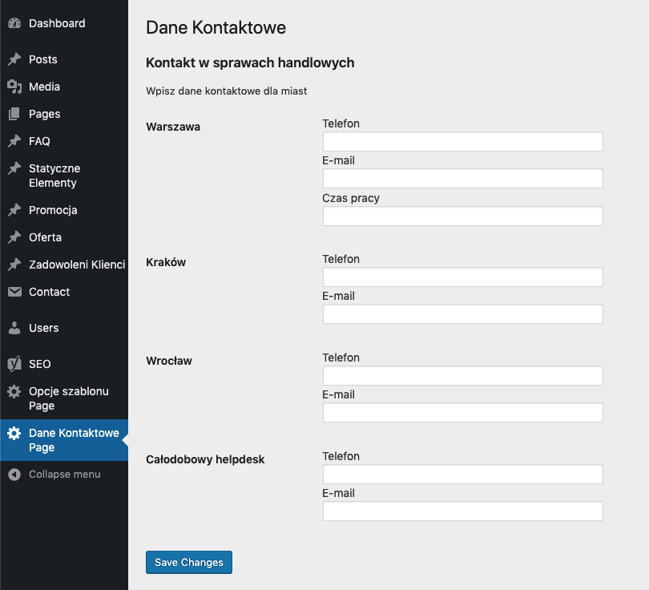

# SW_contact-setting

**Tags:** extel, bedrock, wordpress  
**Tested up to:** 5.1.1  
**Stable tag:** 0.1.0  
**License:** MIT  
**License URI:** https://www.gnu.org/licenses/gpl-2.0.html

**Plugin Name:** SW_contact-setting  
**Plugin URI:** https://github.com/sebastianwesolowski/sw_contact-setting  
**Description:** Simple plugin, use API wordpress setting
**Author:** Sebastian Wesołowski  
**Author URI:** warsztatkodu.pl  
**Text Domain:** SW_contact-setting  
**Domain Path:** /resources/lang  
**Version:** 0.2  
**@package** SW_contact-setting

## Description

Simple plugin, use API wordpress setting

## Changelog

### 1.0.0

- Set setting for 3 town
- separate setting for phone, e-mail, work-time
- 

## TODO

- Create admin panel for this plugiun
